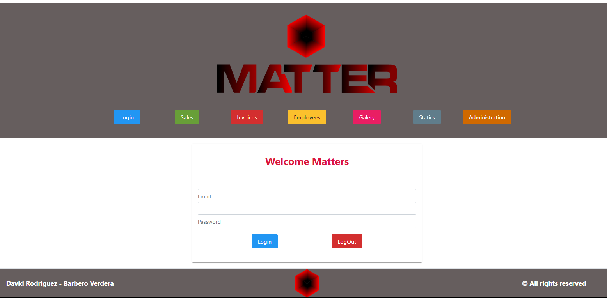
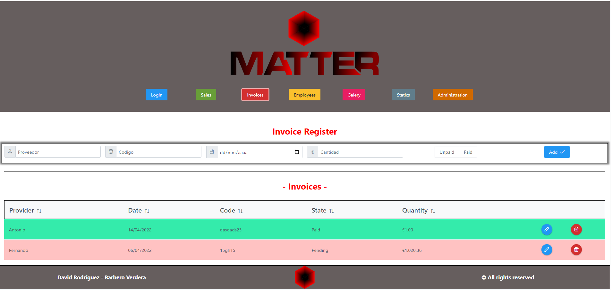
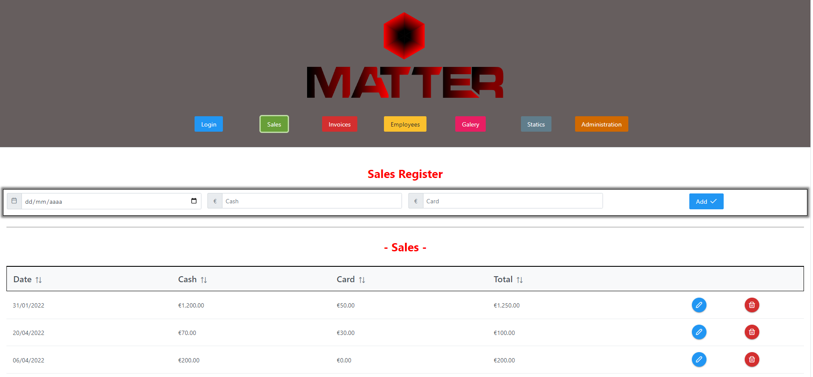
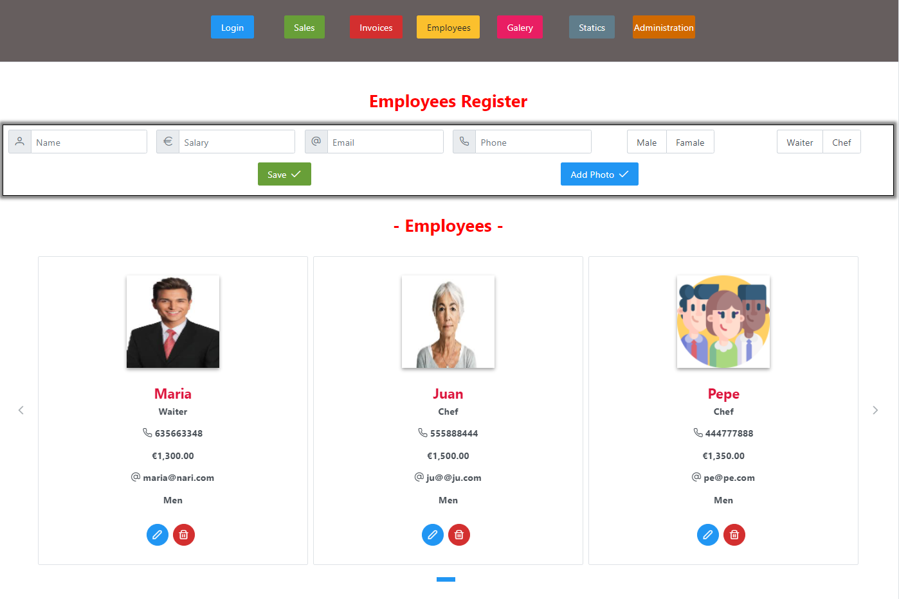
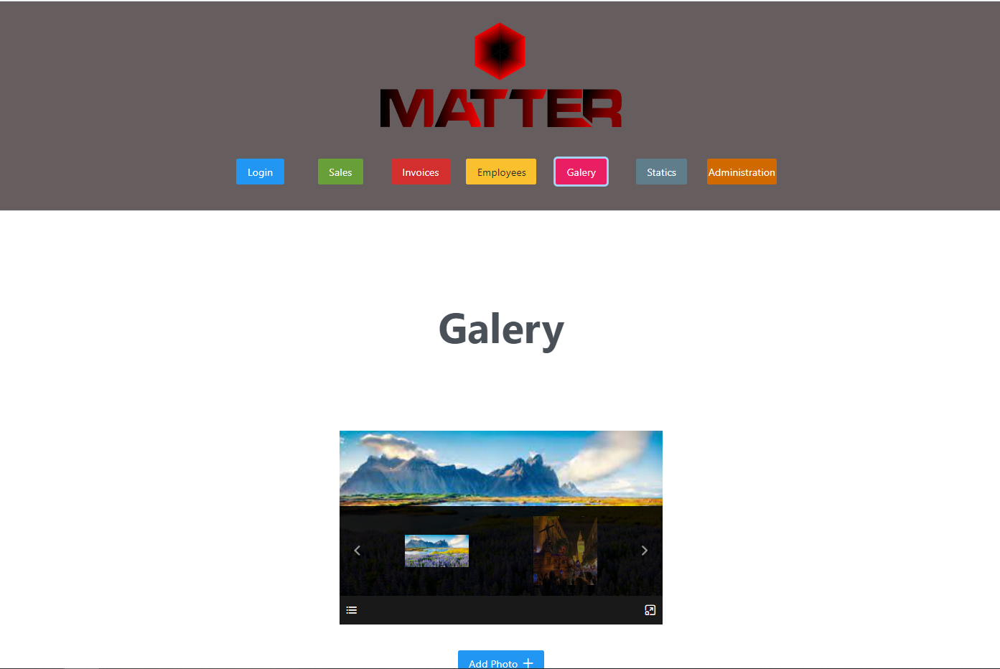
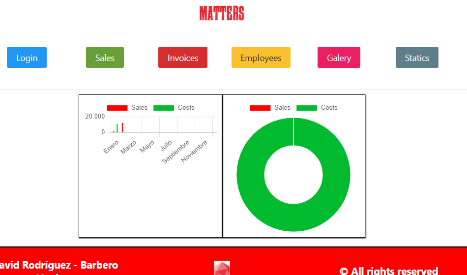
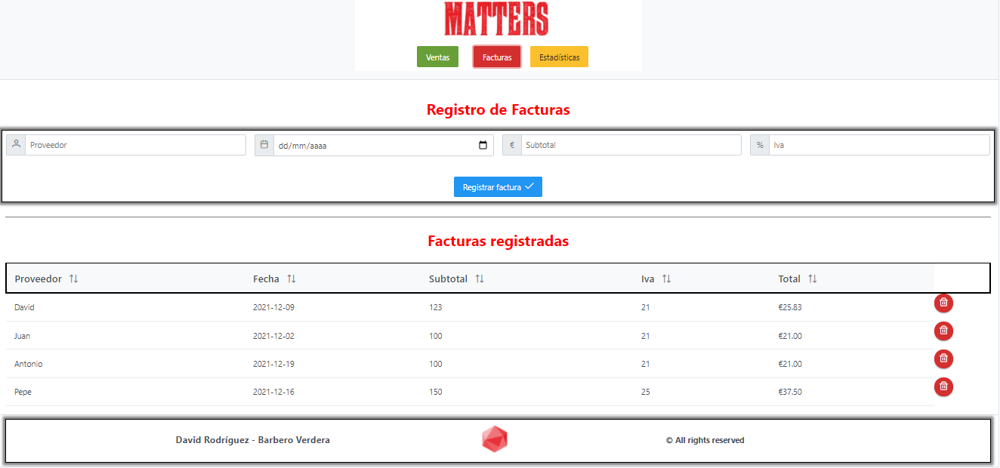

<h2 align="center">PROYECTO GRADO SUPERIOR EN DESARROLLO DE APLICACIONES MULTIPLATAFORMA I.E.S. CAMPANILLAS 21/22</h2>

  
  <h3 align="center">Matter Accounting</h3>

## INTRODUCCIÓN
Como complemento de la App 'Matter Movil', actualmente en desarrollo, y pensando en las necesidades del cliente, este proyecto pretende ampliar las posibilidades de gestión de nuestro negocio, además de dar la posibilidad al cliente de gestionar su empresa desde otro tipo de dispositivo. Además, permitirá a los administradores de la App gestionar los usuarios que actualmente usen la aplicaciñón.   

## OBJETIVO
El objetivo principal es potenciar la calidad de la información que vamos almacenando, así como facilitar la gestión de las necesidades del cliente por parte de los administradores de forma facil e intuitiva.

## DESARROLLO
Para el desarrollo de este proyecto, haremos uso de Angular, Typescript, PrimeNg, Capacitor, Cordova, Firebase añadiendo algunas características especiales a la aplicación desarrollada para la versión movil.
Es importante resaltar, que tanto la versión web como la versión movil harán uso de la misma información almacenada en la base de datos.

## DIARIO DE TRABAJO
<a href="https://github.com/Davidrbv/Matters/blob/master/README.md">
Pulse aquí.
</a>
## BIBLIOGRAFÍA
  - <a href="https://angular.io/">
Angular
</a>
  - <a href="https://www.primefaces.org/primeng/">
PrimeNg
</a>
  - <a href="https://capacitorjs.com/">
Capacitor
</a>
  - <a href="https://ionicframework.com/docs/native/iamport-cordova">
Cordova
</a>
  - <a href="https://console.firebase.google.com/u/2/">
Firebase
</a>
  - <a href="https://www.typescriptlang.org/docs/">
TypeScript
</a>
  - <a href="https://es.stackoverflow.com/">
StackOverflow
</a>

## Mockup App
<<<<<<< HEAD
<h5>Versión actual de la interfaz - 24/04/22<h5>

=======

>>>>>>> 1cfa12bc1290187588278e0e1ecbf13368c0f9b5
