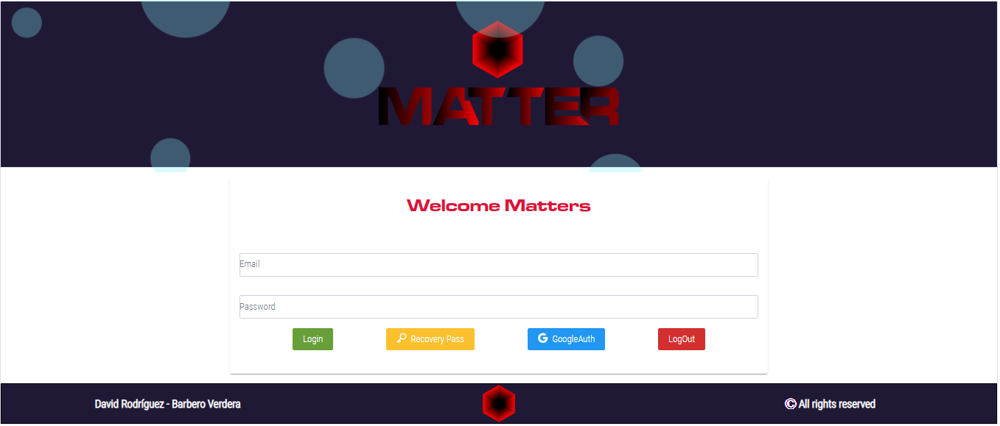
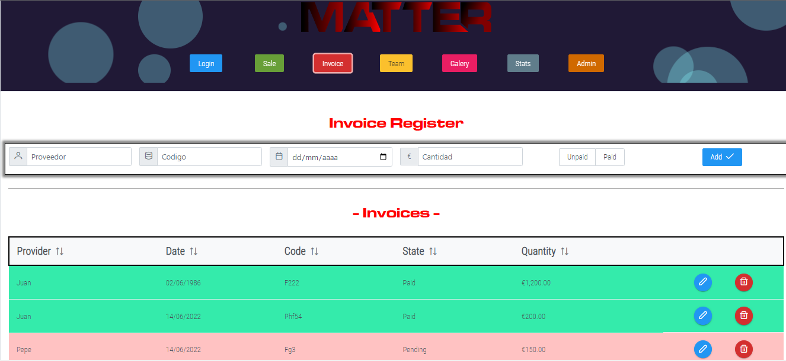
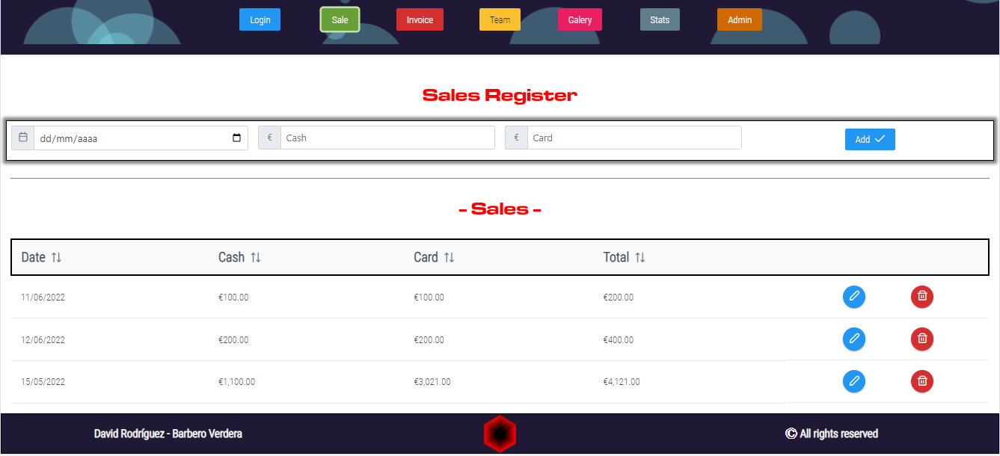
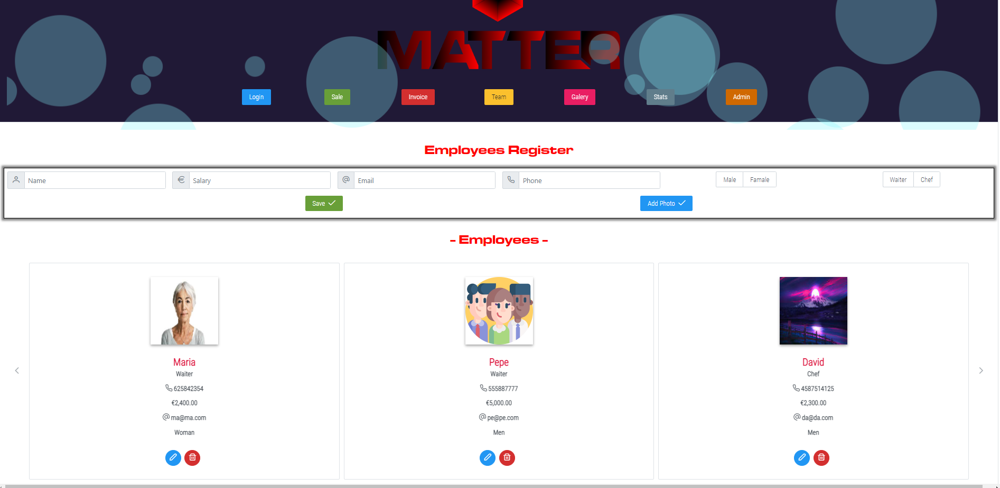
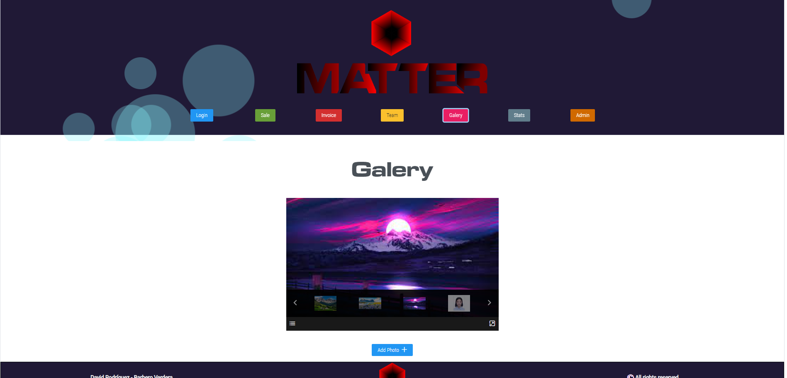
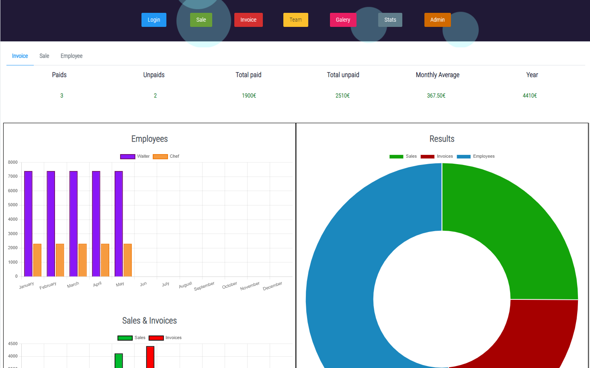
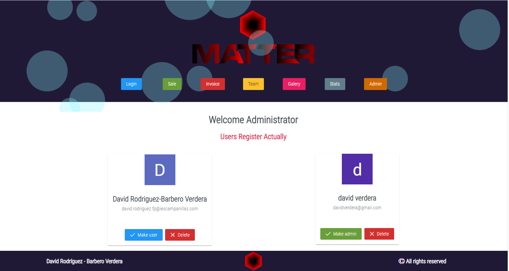
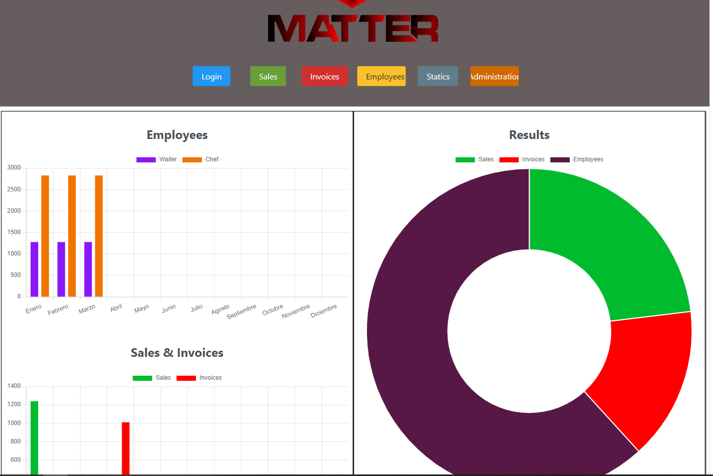

<h2 align="center">PROYECTO SAP GRADO SUPERIOR EN DESARROLLO DE APLICACIONES MULTIPLATAFORMA I.E.S. CAMPANILLAS 21/22</h2>

<h3 align="center">Matter Accounting</h3>
  

## INTRODUCCIÓN
Como complemento de la App 'Matter Movil', actualmente en desarrollo, y pensando en las necesidades del cliente, este proyecto pretende ampliar las posibilidades de gestión de nuestro negocio, además de dar la posibilidad al cliente de gestionar su empresa desde otro tipo de dispositivo. Además, permitirá a los administradores de la App gestionar los usuarios que actualmente usen la aplicaciñón.   

## OBJETIVO
El objetivo principal es potenciar la calidad de la información que vamos almacenando, así como facilitar la gestión de las necesidades del cliente por parte de los administradores de forma facil e intuitiva.

## DESARROLLO
Para el desarrollo de este proyecto, haremos uso de Angular, Typescript, PrimeNg, Capacitor, Cordova, Firebase añadiendo algunas características especiales a la aplicación desarrollada para la versión movil.
Es importante resaltar, que tanto la versión web como la versión movil harán uso de la misma información almacenada en la base de datos.

## DIARIO DE TRABAJO
<a href="https://github.com/Davidrbv/Matters/blob/master/README.md">
Pulse aquí para ver el desarrollo del proyecto.
</a>
## BIBLIOGRAFÍA
  - <a href="https://angular.io/">
Angular
</a>
  - <a href="https://www.primefaces.org/primeng/">
PrimeNg
</a>
  - <a href="https://capacitorjs.com/">
Capacitor
</a>
  - <a href="https://ionicframework.com/docs/native/iamport-cordova">
Cordova
</a>
  - <a href="https://console.firebase.google.com/u/2/">
Firebase
</a>
  - <a href="https://www.typescriptlang.org/docs/">
TypeScript
</a>
  - <a href="https://es.stackoverflow.com/">
StackOverflow
</a>

## Mockup App Actual

- 
En la imagen que se muestra a continuación, podemos observar el Login o pantalla de acceso a la SPA. Cuenta con un botón de Login para ganar acceso al sistema con nuestra credenciales personales, un botón para recuperar la cuenta, uno más para la autenticación con google, y un útlimo botón para cerrar la sesión iniciada por el usuario.

- 
En esta segunda imagen, podemos observar, en la parte superior, los botones de acceso a los diferentes módulos que componen la apliación. En concreo, nos encontramos dentro del módulo de facturas, donde podremos crear, modificar o eliminar las facturas pertinentes relacionadas con el desarrollo del negocio.

- 
En la siguiente imagen se puede observar la estructura del módulo de ventas, con características similares al módulo de facturación, donde, como sucede en el módulo anterior, podremos filtar los elementos por cantidades, fechas o estados.

- 
Como sucedía con la aplicación movil, también contamos con una pantalla de gestión de empleados, donde podremos crear y manipular dicha información en función de nuestras necesidades.

- 
Contamos también, como ya lo haciamos con la aplicación movil, con una galería de imagenes relacionadas con nuestro negocio que podremos manipular con facilidad.

- 
A continuación, se muestra el módulo de estadísticas, el cual nos ofrecerá información de forma gráfica sobre el estado actual de la información contable de la empresa.
En primer lugar nos encontraremos con tres pestañas que nos proporcionarán información general de interés sobre los principales activos de la empresa.
Posteriormente, podremos observar una serie de gráficas que nos porporcionaran una imagen más viaul sobre el estado de gastos, costes y beneficios obtenidos por la empresa.

- 
Por utimo, y de gran relevancia, nos encontramos con el módulo de administración, al que solo tendrán acceso los administradores del sistema pertenecientes a la empresa. Este módulo nos permitirá visualizar los diferentes usuarios registrados en el sistema, cambiar su estado de usuario (administrador o cliente) o eliminar, en caso de que fuera necesario, los usuarios que hayan solicitado la eliminación del registro en al aplicación.

## Mockup App Inicial

