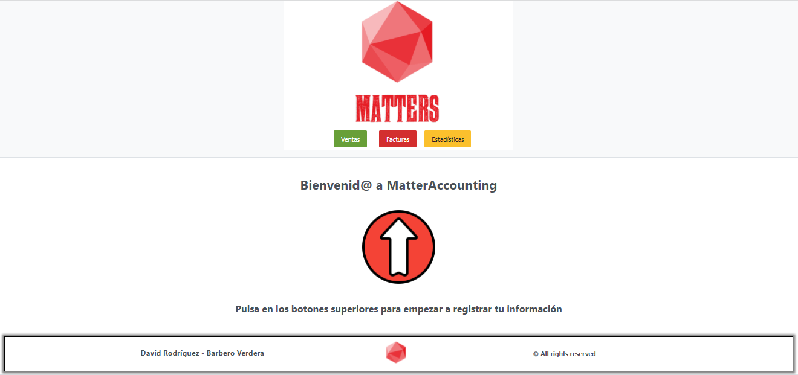
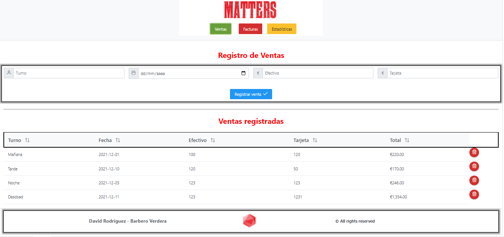
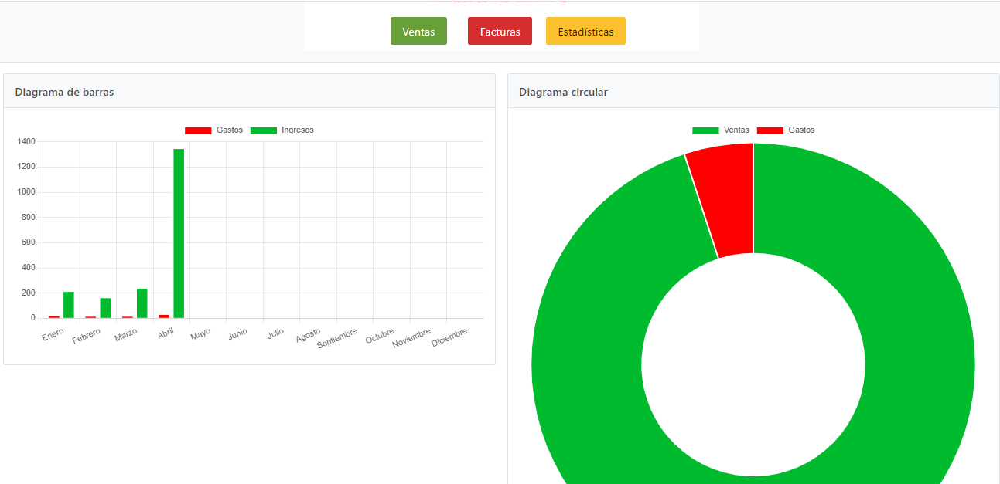

<!-- LOGO PROYECTO -->
 

  

  <h3 align="center">MatterAccounting</h3>
  

 

## Sobre el proyecto
MattersAccounting es una aplicación dedicada al registro de gastos e ingresos
de cualquier tipo de negocio, para el control de los mismos y la visualización
a través de gráficas del rendimiento del negocio.
Surge como ampliación de la App Matter desarrollada en Ionic.

HomePAge: https://github.com/Davidrbv/MatterAccounting/tree/master/src/app

## Estructura del proyecto
<ul>
  <li>3 Páginas</li>
  <li>2 Servicios</li>
  <li>2 Interfaces</li>
</ul>

 

Se hace uso de capacitor para la persistencia de la información,
permitiendonos mantener los datos para cada vez que hacemos uso de la app

## Technologies Used

## Mockup App

